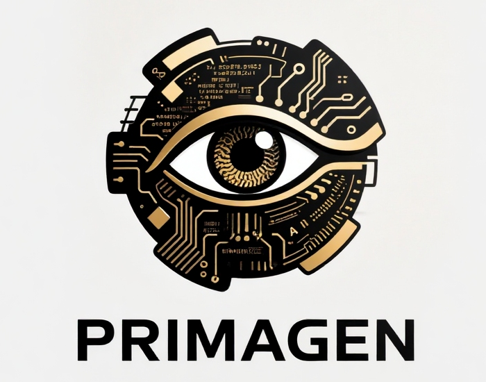

# Primagen  
<p align="center">
  
</p>  

My original intention was Primitive Genesis(元婴), BUT ...  
Primagen, the ancient cosmic creature imprisoned in the underground city, harbors an ambition to annihilate the universe, driven by an extreme lust for power.  
When technology—such as nuclear energy or genetic engineering—breaks free from moral constraints, it can turn into an instrument of destruction.
Similarly, unregulated AI Agents may inflict catastrophic harm.  
If we can restrain Primagen’s malice and guide him toward goodness, a completely different future will unfold.  
Primagen lays bare the inherent evil of human nature.  
Yet even the flower of evil can bear the fruit of good, if carefully nurtured and cultivated.  

> Primagen，这头被囚禁于地底之城的远古宇宙生灵，其毁灭宇宙的狂想，本质是对权力极致贪婪的终极投射。  
> 科技一旦挣脱道德的缰绳 —— 无论是核能、基因工程，还是如今的 AI Agent—— 都将从文明的利刃，蜕变为自我毁灭的凶器。  
> 可真正的启示，不在于镇压这头远古巨兽，而在于驯化与引导：压制其恶，唤醒其善，世界便会走向截然不同的未来。  
> Primagen 映照的，从来不是外星怪物，而是人性深处的幽暗本源。  
> 恶本是天生的种子，但若以理性与良知浇灌，恶之花，亦可结出善之果。  

This is a pure C implementation of the original nanobot project.

## Project Structure
- `src/`: Source code
  - `agent/`: Agent loop (ReAct)
  - `bus/`: Message bus
  - `channels/`: Communication channels
  - `cli/`: CLI commands
  - `common/`: Common implementations
  - `config/`: Configuration loader
  - `context/`: Context builder
  - `cron/`: Cron service
  - `heartbeat/`: Heartbeat service
  - `memory/`: Memory management
  - `providers/`: LLM providers
  - `session/`: Session management
  - `skills/`: Skills loader
  - `subagent/`: Subagent manager
  - `tools/`: Tool registry
  - `vendor/`: Third-party libraries (cJSON)
  - `include/`: Common headers
  - `main.c`: Entry point
- `build/`: Build directory for object files and executable
- `Makefile`: Build script
- `README.md`: This file
- `.primagen/`: Default workspace (logs, memory, config)

## Features Implemented
- Agent Loop with multi-turn ReAct Paradigm
- MessageBus for decoupling channels and agent core
- ContextBuilder for assembling prompts from Identity, Memory, Skills, and History
- Tool registration mechanism (Filesystem, Shell, Web, Subagent, Cron, Skill, Memory)
- Session persistence in JSONL format (filtered for clarity)
- Two-layer Memory System (Long-term facts & Short-term history)
- Subagent Manager for background tasks
- Cron Service for scheduled tasks
- Real LLM Provider (OpenAI/Brave integration)
- Flexible Configuration System
- Comprehensive Logging

**Note on Channels**: The CLI (Command Line Interface) channel is fully implemented. Code structure for Telegram, WhatsApp, Feishu, etc. exists but requires API configuration.

**Note on CLI Arguments**: The application loads configuration from `.primagen/config.json` by default.

## Compilation
```bash
make
```

## Running
```bash
./build/primagen onboard
# Ensure API keys are set in primagen/config.json

./build/primagen
```

The program runs an interactive CLI agent loop.

## Notes
- **Memory**: Refers to the AI's "Memory" (Context/Knowledge), stored in `.primagen/memory/`.
- **Logs**: Application logs are stored in `.primagen/log/`.
- **LLM**: Uses `libcurl` to make real requests to OpenAI API.
- **Tools**: Includes `exec`, `read_file`, `write_file`, `web_search`, `skill`, `memory` etc.
